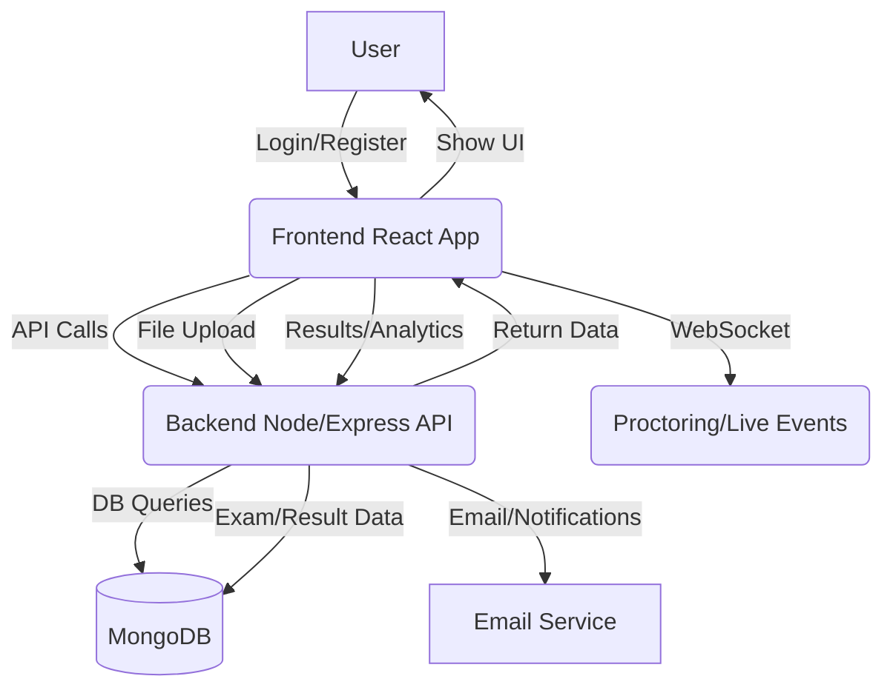
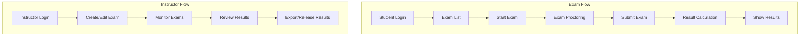

# Exam Proctor (Frontend)

## Overview
A modern React-based exam proctoring platform for students, instructors, and admins. Features include secure exam-taking, live proctoring, results analytics, and robust user management.

---

## Features
- **Student:** Take exams, see results, live proctoring, performance analytics.
- **Instructor:** Create/edit exams, monitor live, review/export results, manage permissions.
- **Admin:** Manage users, system settings, analytics.
- **Proctoring:** Webcam, tab switch, copy/paste detection, suspicious activity alerts.
- **Modern UI:** Responsive, accessible, and beautiful.

---

## Tech Stack
- **React** (TypeScript)
- **Tailwind CSS**
- **React Router**
- **WebSockets** (for live proctoring)
- **API Service:** All API logic in `src/services/api.js`

---

## Setup

```bash
cd exam-proctor
npm install
npm start
```
- Configure API base URL in `src/services/api.js` if needed.

---

## Project Structure
```
src/
  components/      # Reusable UI components
  contexts/        # React Context providers (Auth, Socket, Proctor)
  pages/           # Main app pages (Dashboard, Results, Exams, etc.)
  services/        # Unified API logic (api.js)
  types/           # TypeScript types
```

---

## Main Flows
### 1. User Authentication & Navigation
- Users register/login.
- Role-based dashboard (Student, Instructor, Admin).
- Sidebar navigation (SPA, no reloads).

### 2. Exam Lifecycle
- **Student:** Dashboard → Exam List → Take Exam (with proctoring) → Submit → Results.
- **Instructor:** Dashboard → Create/Edit Exam → Monitor Live → Review/Export Results.

---

## System Flow Diagram


---

## Exam & Proctoring Flow


---

## How It Works
- **All API calls** go through `src/services/api.js` (single source of truth).
- **WebSocket** is used for live proctoring events.
- **State management** is via React Context and hooks.
- **Modals** and navigation are fully SPA (no reloads, smooth transitions).

---

## Development & Contribution
- Use feature branches and PRs.
- Run `npm run lint` to check for code quality.
- All API endpoints are documented in the backend repo. 